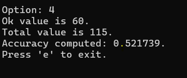
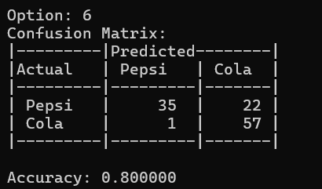
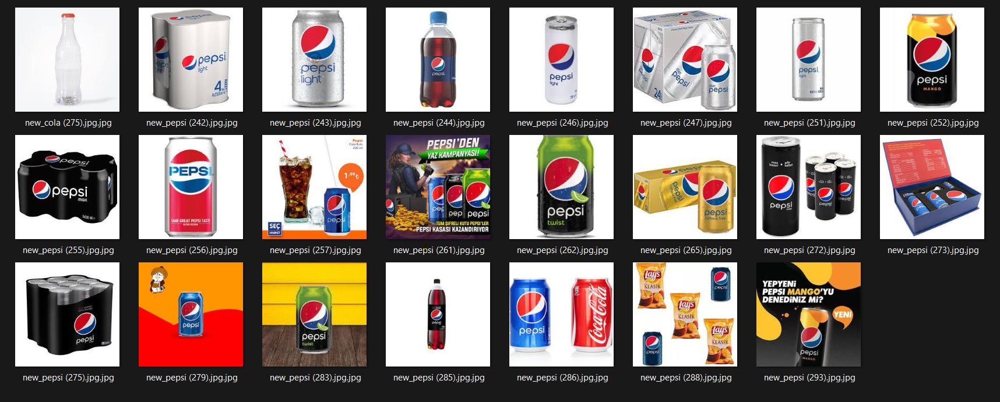
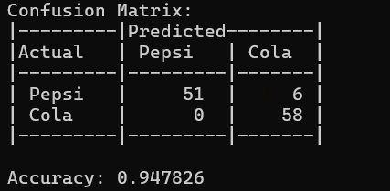
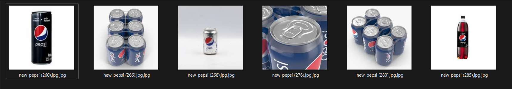
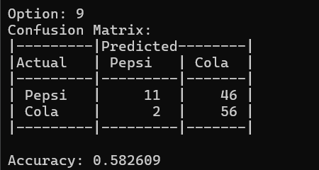

# **_Pepsi&Cola image labeling project_**

This project is designed to automate the labeling of images based on the identification of Pepsi and Cola. Utilizing image processing techniques, the project classifies images by analyzing specific **color patterns** and **content**. The primary objective is to differentiate between images containing a Pepsi logo and those containing Cola logo.
## **Project Structure**

The project is structured to handle two main sets of images: a training set and a test set. These sets are used to train the classification model and evaluate its performance, respectively.

### Training Set
- **Purpose:** The training set is used to develop and refine the algorithms for image classification. By analyzing these images, the system learns to distinguish between Pepsi and Cola cans based on their visual characteristics.
- **Size:** The training set contains 470 images.

### Test Set

- **Purpose:** The test set is used to evaluate the performance of the classification algorithms. It helps in assessing how well the trained model generalizes to new, unseen images.
- **Size:** The test set contains 115 images.

### Struct myStruct

The myStruct structure encapsulates essential data about each image. It contains the following fields:

    struct myStruct {
      string filePath;
      int label;
      Vec3b RGB;
      Vec3b averageRGBperLabel;
    };

+ filePath: A string representing the file path of the image. This is used to load and process the image.
* label: An integer representing the label of the image. Labels are used to categorize the images as either Pepsi or Cola.
* RGB: A Vec3b (vector of three bytes) representing the average RGB color values of the image. This is used for color-based classification.
* averageRGBperLabel: A Vec3b representing the average RGB values calculated for each label across the training set. This helps in comparing and classifying new images.

## Utility functions

1. _testOpenImage() -_ 
   This function allows the user to open and view an image. The user can select an image using a file dialog, and the selected image will be displayed in a new window.

2. _processImages(FileGetter& fg, set<myStruct>& fileSet, const char* message)_ - 
   This function processes all images in train and set folders. It reads each image and adds it to a set, assigning a label based on the filename (0 for images containing "pepsi" and 1 for images containing "cola").

3. _generateLabel(set<myStruct> testSet, set<myStruct>& newSet, const char* message)_ - 
   This function generates random labels for each image in the test set. It iterates through the test set, assigns a random label (0 or 1), and adds the labeled image data to a new set.

4. _computeAccuracy(set<myStruct>& set1, set<myStruct>& set2)_ - 
   This function computes the accuracy of labeling by comparing two sets of images. It calculates the number of correctly labeled images and computes the accuracy as a percentage.

5. _readColor(set<myStruct>& testSet, set<myStruct>& newSet)_ -
   This function reads the color information from each image in the test set and assigns labels based on the predominant color. Images with more red pixels are labeled as 1, while those with more blue pixels are labeled as 0.

6. _computeAccuracyByColor(set<myStruct>& testSet, set<myStruct>& newSet)_ -
   This function computes the accuracy of color-based labeling by comparing the actual and predicted labels. It generates a confusion matrix and calculates the overall accuracy.

    ### Confusion Matrix
    
    | Actual | Predicted Pepsi    | Predicted Cola    |
    |--------|--------------------|-------------------|
    | Pepsi  | True Positive      | False Negative    |
    | Cola   | False Positive     | True Negative     |

   * True Positive (TP): The number of Pepsi images correctly classified as Pepsi.
   * False Negative (FN): The number of Pepsi images incorrectly classified as Cola.
   * False Positive (FP): The number of Cola images incorrectly classified as Pepsi.
   * True Negative (TN): The number of Cola images correctly classified as Cola.

7. _generateRGB(set<myStruct> trainSet, set<myStruct>& newSetRGB)_ - 
   This function computes the average RGB values for each image in the training set and assigns these values to the corresponding images. It also calculates the average RGB values per label (0 and 1) and updates the dataset with these averages.

8. _assignLabels(set<myStruct>& testSet, set<myStruct>& newTestSetRGB, Vec3b& avgRGBLabel0, Vec3b& avgRGBLabel1)_ -
   This function assigns labels to the test images based on the Euclidean distance between the image's average RGB values and the average RGB values of the training set labels. The label with the smallest distance is assigned to the test image.

9. _moveIncorrectImages(set<myStruct>& set1, set<myStruct>& set2, const string& destinationFolder)_ - 
    This function moves incorrectly labeled images to a specified folder. It compares the labels in two sets and moves the images with mismatched labels to the destination folder.

10. _generateLabelPepsiLogo(set<myStruct> testSet, set<myStruct>& newSet, const char* message)_ - 
    This function generates labels for test images based on the presence of the color blue. If the color blue is found in the image, the label is set to 0, otherwise it is set to 1.

11. _testSets(const set<myStruct>& trainSet, const set<myStruct>& testSet)_ - 
    This function verifies that the training set contains 470 images and the test set contains 115 images. It prints a message indicating whether the test has passed or failed based on these conditions.

## Results 

1. _Random Label Generation_
   The initial method involved generating random labels for the test images. 

   + Accuracy: As expected, the accuracy of random labeling was approximately 50%, given the equal probability of assigning any label.
   + Conclusion: Random labeling is not a viable method for practical image classification tasks.
     

2. _Color-based Classification_
   + Accuracy: The color-based classification method achieved an accuracy of 80% (0.8000). 
   + Conclusion: The method was relatively effective but could be further improved by incorporating additional features and refining the color detection algorithms.
    
   
   Images incorrectly labeled by this method:
   

   Scenarios where the method failed
   - Mixed Colors in Packaging:

    Many Pepsi products feature packaging with significant amounts of both red and blue. This can confuse the algorithm, leading to incorrect labels.
    Example: The image new_pepsi (256).jpg.jpg has both prominent red and blue areas, which could lead to misclassification.
    Special Editions and Variants:

   - Special editions of Pepsi or Cola products may have different color schemes that deviate from the typical red or blue dominance.
    Example: The image new_pepsi (252).jpg.jpg shows a Pepsi Mango variant with a significant amount of orange and black, which can skew the color analysis.

   - Background and Advertising Content:
    Images that include advertisements, backgrounds, or additional content can introduce colors that do not accurately represent the product itself.
    Example: The image new_pepsi (261).jpg.jpg includes a promotional advertisement with a mix of colors, potentially leading to incorrect labeling.

   - Non-standard Packaging:
    Images showing non-standard packaging, such as multi-packs or special containers, might contain other colors that affect the classification.
    Example: The image new_pepsi (255).jpg.jpg shows a six-pack of Pepsi Max with a lot of black, which can confuse the algorithm.
       
3. _Specific Color Detection for Pepsi Logo_
   + Accuracy: The accuracy of this method was high, achieving 94% (0.94) for images with distinct color patterns representative of Pepsi and Cola.
   + Conclusion: This method is highly effective for distinguishing Pepsi cans and shows great potential for real-world applications with minimal false positives.
    

    Images incorrectly labeled by this method:
    

4. _Euclidean Distance-Based Classification_
   + Accuracy: This method demonstrated a lower accuracy of 58% (0.58) due to the extremely close average RGB values between the two labels, which made distinguishing between them more challenging.
   + Conclusion: While the Euclidean distance-based method showed potential, its performance was hindered by the close proximity of average RGB values for Pepsi and Cola images. Further refinement and additional features might improve its accuracy.
    
